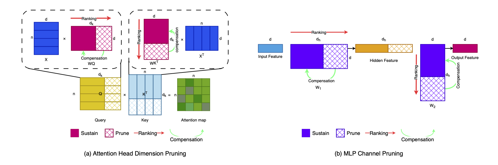

**One-shot structured pruning for Transformers. No labels. No gradients. No finetuning.**

[](https://arxiv.org/abs/2602.05243)

[](https://github.com/BOX-LEO/CORP)

## Overview

Transformer models achieve strong accuracy but require high compute and memory.  
This limits deployment on edge and real-time systems.

CORP enables **one-shot structured pruning** under strict post-training constraints.  
It removes channels and attention dimensions in a single pass.

CORP treats pruning as a **representation recovery problem**.

We approximate removed features with an affine model:
$$
x_P ≈ B x_S + c
$$
Then fold compensation into weights:
$$
\widehat W_S = W_S + W_P B \\
\widehat b = b + W_P c
$$
This minimizes representation error without retraining.

## Method



**Step 1. Structured pruning**

- Remove MLP hidden dimensions  
- Remove attention Q/K dimensions  

**Step 2. Closed-form compensation**
- Fit affine predictor using calibration data  
- Solve with ridge regression  
- Fold into model weights  

**Step 3. One-shot deployment**
- No finetuning  
- No extra inference cost  

## Results

CORP preserves accuracy under high sparsity.

| Model | Base Top1 | FLOPs | Params | MLP Top1 | MLP FLOPs (↓) | MLP Params | Attn Top1 | Attn FLOPs (↓) | Attn Params | Both Top1 | Both FLOPs (↓) | Both Params |
| ----- | --------- | ----- | ------ | -------- | ------------- | ---------- | --------- | -------------- | ----------- | --------- | -------------- | ----------- |
| Tiny  | 72.02     | 1.4   | 5.7    | 55.37    | 1.1 (24.3%)   | 3.9        | 64.25     | 1.1 (21.6%)    | 5.3         | 41.36     | 0.8 (45.9%)    | 3.5         |
| Small | 79.72     | 5.0   | 22.1   | 69.34    | 3.6 (28.1%)   | 15.0       | 72.49     | 4.2 (16.0%)    | 20.3        | 58.37     | 2.8 (44.1%)    | 13.2        |
| Base  | 81.74     | 18.3  | 86.6   | 72.00    | 12.7 (30.5%)  | 58.2       | 80.80     | 16.0 (12.5%)   | 79.5        | 72.00     | 10.4 (43.0%)   | 58.2        |
| Large | 84.58     | 63.5  | 304.4  | 82.05    | 43.7 (31.2%)  | 203.7      | 83.61     | 56.2 (11.6%)   | 279.2       | 80.30     | 36.3 (42.8%)   | 178.5       |
| Huge  | 84.97     | 173.0 | 632.1  | 84.07    | 119.0 (31.2%) | 422.3      | 84.18     | 153.0 (11.7%)  | 579.7       | 83.27     | 98.7 (42.9%)   | 369.9       |

This table shows Top-1 accuracy, FLOPs, and parameter count under 50% structured pruning of Deit models on Imagenet classification task. MLP pruning yields larger FLOPs reduction but causes stronger accuracy drop. Attention pruning preserves accuracy better but reduces less compute. Joint pruning achieves the highest efficiency, with about 40–45% FLOPs reduction, while maintaining strong performance on large models. The results confirm that larger transformers contain more structured redundancy and benefit most from closed-form compensation.

| Model  | Sparsity | Top-1 (%) | Params (M) | FLOPs (G) | Lat (ms) | TP (fps) | Param↓ (%) | FLOPs↓ (%) | TP↑ (×) |
| ------ | -------- | --------- | ---------- | --------- | -------- | -------- | ---------- | ---------- | ------- |
| DeiT-H | baseline | 84.97     | 632.1      | 172.8     | 43.17    | 0.24     | 0.0        | 0.0        | 1.00    |
| DeiT-H | 0.10     | 84.96     | 579.7      | 153.7     | 48.56    | 0.39     | 9.0        | 11.1       | 1.12    |
| DeiT-H | 0.20     | 84.91     | 527.2      | 139.9     | 52.10    | 0.27     | 16.6       | 19.0       | 1.21    |
| DeiT-H | 0.30     | 84.66     | 474.8      | 126.2     | 57.06    | 0.31     | 24.9       | 26.9       | 1.32    |
| DeiT-H | 0.40     | 84.23     | 422.3      | 112.4     | 63.22    | 0.32     | 33.2       | 35.0       | 1.46    |
| DeiT-H | 0.50     | 83.27     | 369.9      | 98.7      | 70.75    | 0.33     | 41.5       | 42.9       | 1.64    |
| DeiT-H | 0.60     | 80.98     | 317.4      | 84.9      | 78.46    | 0.35     | 49.8       | 50.9       | 1.82    |
| DeiT-H | 0.70     | 75.38     | 265.0      | 71.2      | 92.00    | 0.57     | 58.1       | 58.8       | 2.13    |

This table shows the trade-off between accuracy and efficiency as sparsity increases. Accuracy remains stable up to moderate sparsity, with only a small drop at 50% pruning (84.97 → 83.27). At the same time, parameters and FLOPs decrease steadily, reaching over 40% reduction at 50% sparsity. Throughput improves consistently and exceeds 2× at high sparsity. Latency does not decrease monotonically due to hardware and memory effects, but overall efficiency follows FLOPs reduction. These results show that CORP achieves strong practical speedup while preserving accuracy, especially at moderate sparsity levels.

## Features

| Mthd       | Scope         | structured | label-free | gradient-free | Hessian-free | finetuning-free |
| ---------- | ------------- | ---------- | ---------- | ------------- | ------------ | --------------- |
| CORP(Ours) | MLP+Attention | ✅          | ✅          | ✅             | ✅            | ✅               |

## Limitations

- Compensation is layer-wise  
- Errors may accumulate at high sparsity  
- Sensitive to calibration–test distribution shift  
- No global optimality guarantee  

## Citation

```bibtex
@misc{zhang2026corpclosedformoneshotrepresentationpreserving,
      title={CORP: Closed-Form One-shot Representation-Preserving Structured Pruning for Vision Transformers}, 
      author={Boxiang Zhang and Baijian Yang},
      year={2026},
      eprint={2602.05243},
      archivePrefix={arXiv},
      primaryClass={cs.LG},
      url={https://arxiv.org/abs/2602.05243}, 
}